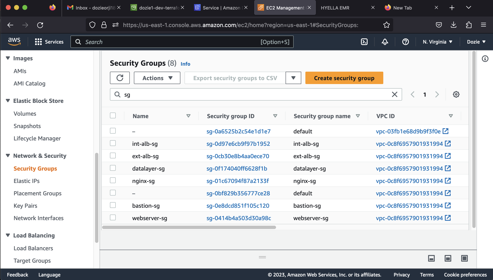

# AUTOMATING INFRASTRUCTURE WITH IAC USING TERRAFORM PART 3 – REFACTORING
## INTRODUCTION
In continuation to [Project 17](https://github.com/nicedozie4u/Project17/blob/main/project17.md), the entire code is refactored inorder to simplify the code using a Terraform tool called **Module**.

The following outlines detailed step taken to achieve this:


## STEP 1: Refactoring The Codes Using Module

- Creating a folder called **modules**
- Creating the following folders inside the **modules** folder to combine resources of the similar type: **ALB, VPC, Autoscaling, Security, EFS, RDS, Compute**
- Creating the following files for each of the folders: **main.tf, variables.tf and output.tf**

**pbl folder structure**


- Refactoring the code for **VPC** folder:

**outputs.tf**


- Refactoring the code for **ALB** folder:

**variables.tf**


**outputs.tf**


- Refactoring the code for **Autoscaling** folder:

**variables.tf**


- Refactoring the code for **security** folder:

**outputs.tf**


- Refactoring the code for **EFS** folder:

**variables.tf**


- Refactoring the code for **RDS** folder:

**variables.tf**


- Refactoring the code the root **main.tf** folder:


- The complete code structure is stored in this [repo](https://github.com/nicedozie4u/PBL-project-18)

## STEP 2: Executing The Terraform Plan

- First initialize terraform
**terraform init**


- To ensure the validation of the whole setup, running the command **terraform validate**


- Testing the configuration by running the command **terraform plan**


**terraform apply**


- Confirm infrastructure created 





**Now we are going to introduce Backend on S3.**

So far, we have been using the default backend, which is the local backend – it requires no configuration, and the states file is stored locally. This mode can be suitable for learning purposes, but it is not a robust solution, so it is better to store it in some more reliable and durable storage.

The second problem with storing this file locally is that, in a team of multiple DevOps engineers, other engineers will not have access to a state file stored locally on your computer

To solve this, we will need to configure a backend where the state file can be accessed remotely other DevOps team members. There are plenty of different standard backends supported by Terraform that you can choose from. Since we are already using AWS – we can choose an S3 bucket as a backend.

Another useful option that is supported by S3 backend is State Locking – it is used to lock your state for all operations that could write state. This prevents others from acquiring the lock and potentially corrupting your state. State Locking feature for S3 backend is optional and requires another AWS service – DynamoDB.

Create an S3 bucket to store Terraform state file with a unique name

## Configuring A Backend On The S3 Bucket
By default the Terraform state is stored locally, to store it remotely on AWS using S3 bucket as the backend and also making use of DynamoDB as the State Locking the following setup is done:
- Creating a file called **Backend.tf** and entering the following code:
```
resource "aws_s3_bucket" "terraform-state" {
  bucket = "dozie2-dev-terraform-bucket"
  force_destroy = true
}
resource "aws_s3_bucket_versioning" "version" {
  bucket = aws_s3_bucket.terraform-state.id
  versioning_configuration {
    status = "Enabled"
  }
}
resource "aws_s3_bucket_server_side_encryption_configuration" "first" {
  bucket = aws_s3_bucket.terraform-state.id
  rule {
    apply_server_side_encryption_by_default {
      sse_algorithm = "AES256"
    }
  }
}
```
- Adding the following code which creates a DynamoDB table to handle locks and perform consistency checks:
```
resource "aws_dynamodb_table" "terraform_locks" {
  name         = "terraform-locks"
  billing_mode = "PAY_PER_REQUEST"
  hash_key     = "LockID"
  attribute {
    name = "LockID"
    type = "S"
  }
}
```
- Since Terraform expects that both S3 bucket and DynamoDB resources are already created before configuring the backend, executing terraform apply command:


- Entering the following code to configure the backend:
```
terraform {
  backend "s3" {
    bucket         = "dozie2-dev-terraform-bucket"
    key            = "global/s3/terraform.tfstate"
    region         = "us-east-1"
    dynamodb_table = "terraform-locks"
    encrypt        = true
  }
}
```


